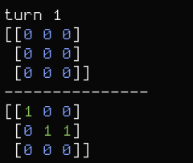
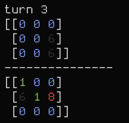

# small battle ship

battle ship where you play against the computer.

the board is a matrix n by n. Here is an example with a 3x3 board.

the board in the lower part represents your ships, the one above the enemy
territory.

WIP
